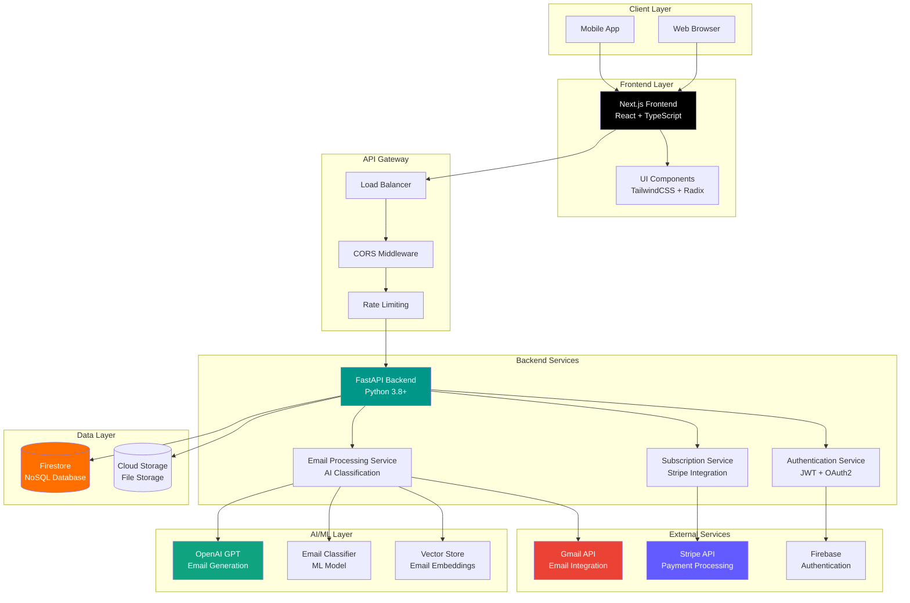
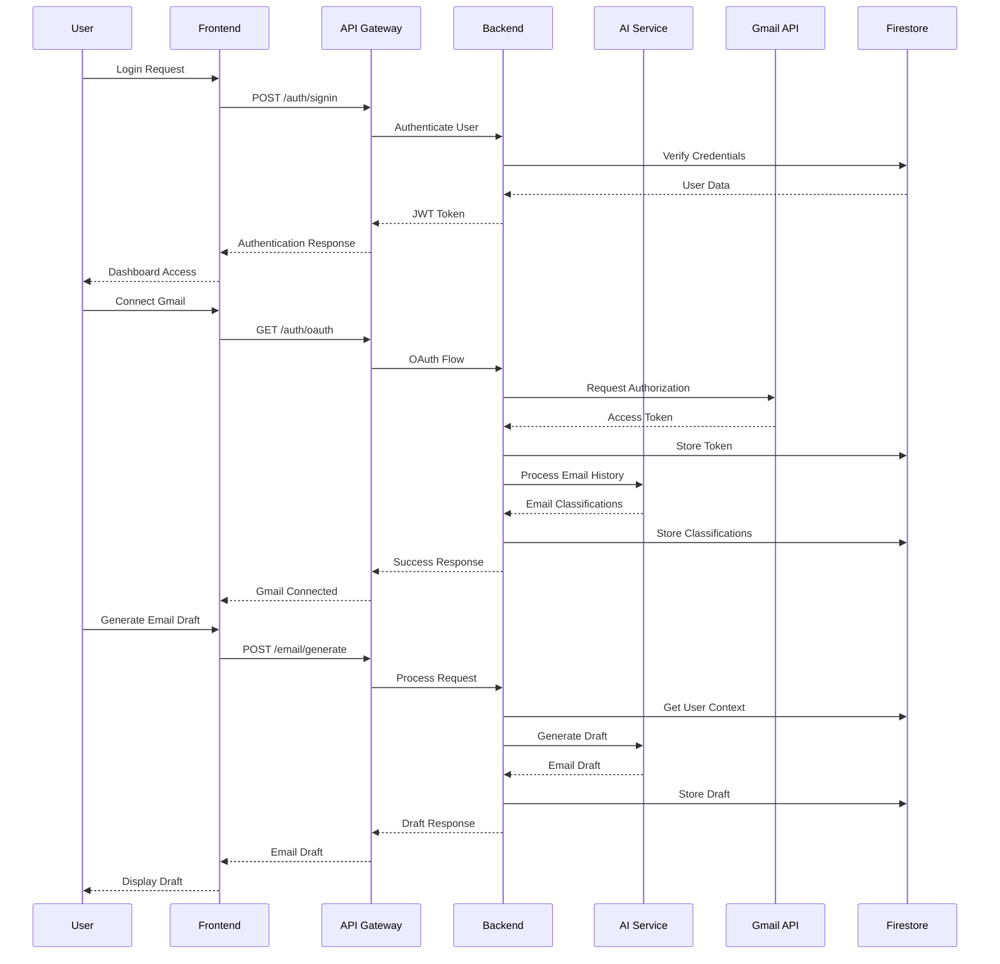
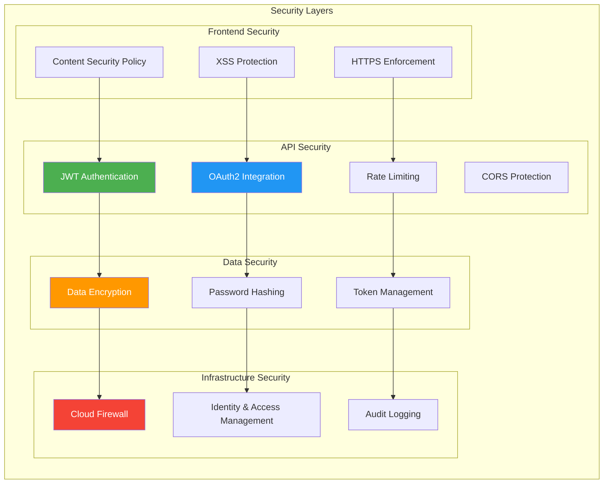

# Notaic - Email Automation Platform

[](https://fastapi.tiangolo.com)
[](https://nextjs.org/)
[](https://www.python.org/downloads/)
[](https://www.typescriptlang.org/)
[](LICENSE)

<div align="center">
  
</div>

Notaic is a sophisticated email automation and management platform that helps users streamline their email workflows through AI-powered classification, automation, and intelligent processing.

## Key Features

- **Email Management & Automation**
  - AI-powered email classification
  - Automated email processing
  - Smart email routing and organization

- **User Authentication & Security**
  - Multi-factor authentication
  - OAuth2 integration
  - JWT-based secure sessions

- **Subscription Management**
  - Stripe integration for payments
  - Usage-based billing
  - Multiple subscription tiers

- **Analytics & Insights**
  - Email analytics dashboard
  - Usage statistics
  - Performance metrics

## System Architecture

### High-Level Architecture Overview



### Data Flow Architecture



### Security Architecture



## Project Structure

The project follows a monorepo structure with separate frontend and backend components:

```
notaic/
├── frontend/                # Next.js frontend application
│   ├── app/                # Application routes and pages
│   ├── components/         # React components
│   ├── lib/               # Utility functions
│   └── [More details in frontend/README.md]
│
├── backend/                # FastAPI backend application
│   ├── auth/              # Authentication services
│   ├── config/            # Configuration management
│   ├── models/            # Data models and ML models
│   ├── tests/             # Test suites
│   │   ├── e2e/          # End-to-end tests
│   │   └── unit/         # Unit tests
│   └── [More details in backend/README.md]
│
├── demos/
└── README.md             # This file
```

For detailed documentation:
- [Frontend Documentation](frontend/README.md)
- [Backend Documentation](backend/README.md)

## Getting Started

### Prerequisites

- Python 3.8+
- Node.js 18+
- Docker and Docker Compose (optional)
- Git

### Local Development Setup

1. Clone the repository:
   ```bash
   git clone https://github.com/blakeamtech/notaic.git
   cd notaic
   ```

2. Set up the backend:
   ```bash
   cd backend
   python -m venv venv
   source venv/bin/activate  # On Windows: .\venv\Scripts\activate
   pip install -r requirements.txt
   ```

3. Set up the frontend:
   ```bash
   cd frontend
   npm install
   ```

4. Configure environment variables:
   - Backend: Copy `.env.example` to `.env`
   - Frontend: Copy `.env.example` to `.env.local`

5. Start the development servers:
   ```bash
   # Terminal 1 - Backend
   cd backend
   uvicorn main:app --reload

   # Terminal 2 - Frontend
   cd frontend
   npm run dev
   ```

### Docker Setup

Run the entire stack using Docker Compose:
```bash
docker-compose up --build
```

## Testing

### Backend Testing

```bash
cd backend

# Run unit tests
pytest tests/unit/

# Run e2e tests
pytest tests/e2e/

# Run with coverage
pytest --cov=app tests/
```

### Frontend Testing

```bash
cd frontend

# Run linting
npm run lint

# Type checking
npm run type-check
```

## API Documentation

- Backend API (when running locally):
  - Swagger UI: http://localhost:8000/docs
  - ReDoc: http://localhost:8000/redoc

## Security

- Environment variables for sensitive data
- JWT-based authentication
- CORS protection
- Rate limiting
- Input validation
- XSS prevention
- Secure password hashing

## Deployment

### Backend Deployment

The backend can be deployed to any cloud platform that supports Docker containers or Python applications. Recommended platforms:
- Google Cloud Run
- AWS ECS
- Heroku

### Frontend Deployment

The Next.js frontend can be deployed to:
- Vercel (recommended)
- Netlify
- AWS Amplify

## Contributing

1. Fork the repository
2. Create your feature branch (`git checkout -b feature/AmazingFeature`)
3. Commit your changes (`git commit -m 'Add some AmazingFeature'`)
4. Push to the branch (`git push origin feature/AmazingFeature`)
5. Open a Pull Request

Please read our [Contributing Guidelines](CONTRIBUTING.md) for details on our code of conduct and development process.

---
Built with ❤️ by the Notaic Team
