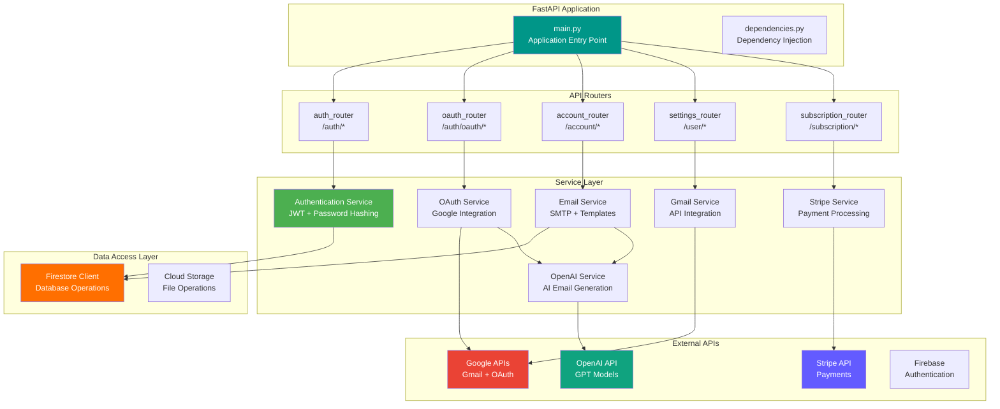
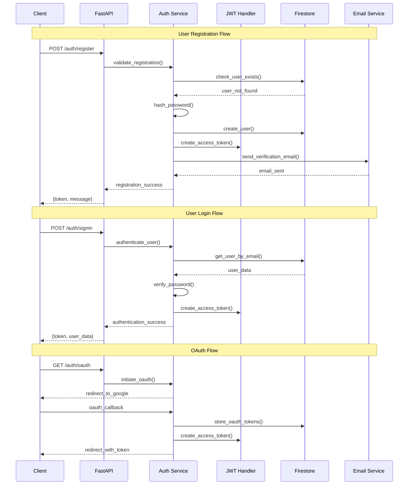
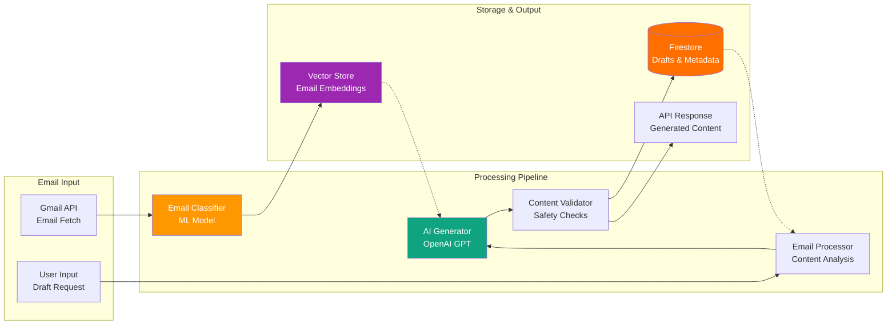
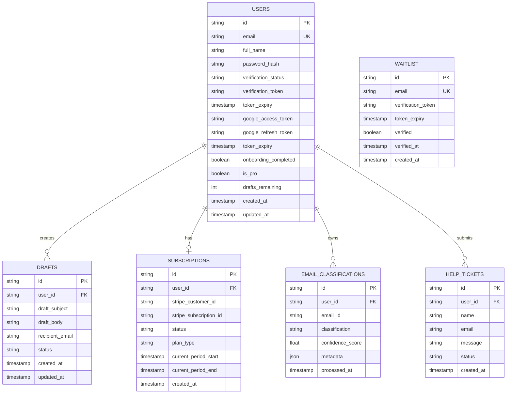
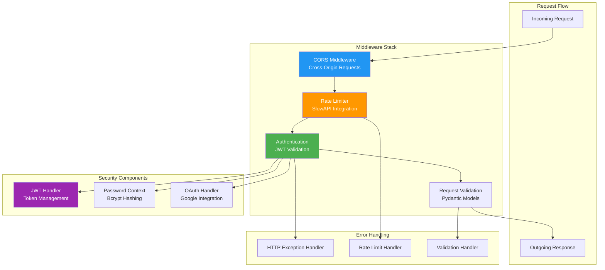

# Notaic Backend

[](https://fastapi.tiangolo.com)
[](https://www.python.org/downloads/)
[](LICENSE)

Notaic is a sophisticated email automation and management platform built with FastAPI. It provides user authentication, email processing, and subscription management capabilities through a robust REST API.

## Features

- **Authentication & Authorization**
  - User registration and email verification
  - OAuth2 authentication
  - JWT-based authentication
  - Rate limiting

- **Email Management**
  - Email classification using ML models
  - Email processing and automation
  - Gmail integration

- **Subscription System**
  - Stripe integration for payment processing
  - Subscription management
  - Usage tracking

- **Additional Features**
  - User settings management
  - Account management
  - CORS protection
  - API rate limiting

## Backend Architecture

### API Service Architecture



### Authentication Flow



### Email Processing Pipeline



### Database Schema



### Middleware & Security Stack



## Prerequisites

- Python 3.8 or higher
- pip (Python package manager)
- Virtual environment (recommended)

## Installation

1. Clone the repository:
   ```bash
   git clone https://github.com/yourusername/NotaicBackend.git
   cd NotaicBackend
   ```

2. Create and activate a virtual environment:
   ```bash
   python -m venv venv
   # On Windows
   .\venv\Scripts\activate
   # On Unix or MacOS
   source venv/bin/activate
   ```

3. Install dependencies:
   ```bash
   pip install -r requirements.txt
   ```

4. Set up environment variables:
   Create a `.env` file in the root directory and add the following variables:
   ```env
   # API Configuration
   API_HOST=0.0.0.0
   API_PORT=8000

   # Authentication
   JWT_SECRET_KEY=your_jwt_secret
   JWT_ALGORITHM=HS256

   # External Services
   STRIPE_API_KEY=your_stripe_key
   OPENAI_API_KEY=your_openai_key
   
   # Add other required environment variables
   ```

## Running the Application

1. Start the FastAPI server:
   ```bash
   uvicorn main:app --reload
   ```

2. Access the API documentation:
   - Swagger UI: `http://localhost:8000/docs`
   - ReDoc: `http://localhost:8000/redoc`

## Testing

The project includes both unit tests and end-to-end tests:

```bash
# Run unit tests
pytest tests/unit/

# Run e2e tests
pytest tests/e2e/

# Run all tests with coverage
pytest --cov=app tests/
```

## Project Structure

```
NotaicBackend/
├── auth/                 # Authentication related modules
├── config/              # Configuration files
├── data/                # Data storage and management
├── miscellaneous/       # Utility scripts
├── models/              # ML models and data schemas
├── settings/            # User settings management
├── tests/               # Test suites
│   ├── e2e/            # End-to-end tests
│   └── unit/           # Unit tests
├── utils/               # Utility functions
├── main.py             # Application entry point
├── dependencies.py     # Dependency injection
└── requirements.txt    # Project dependencies
```

## Security

- CORS is configured to allow only specific origins
- Rate limiting is implemented to prevent abuse
- JWT-based authentication
- Secure password hashing
- Environment variable management for sensitive data

## API Documentation

The API documentation is automatically generated and can be accessed at:
- `/docs` - Swagger UI documentation
- `/redoc` - ReDoc documentation

## Contributing

1. Fork the repository
2. Create a new branch (`git checkout -b feature/improvement`)
3. Make your changes
4. Commit your changes (`git commit -am 'Add new feature'`)
5. Push to the branch (`git push origin feature/improvement`)
6. Create a Pull Request

## License

This project is licensed under the MIT License - see the [LICENSE](LICENSE) file for details.

## Contact

For any questions or concerns, please open an issue in the GitHub repository.

---
Built with ❤️ using FastAPI and Python
