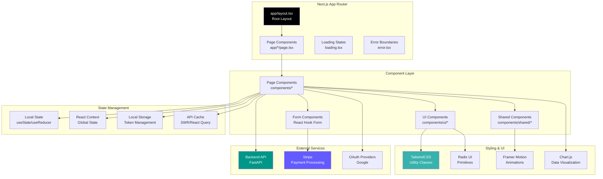
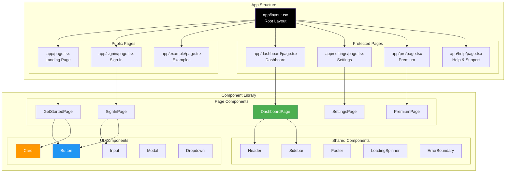
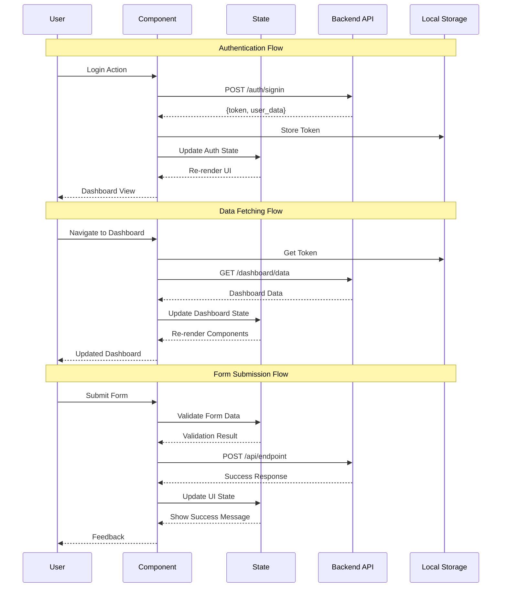
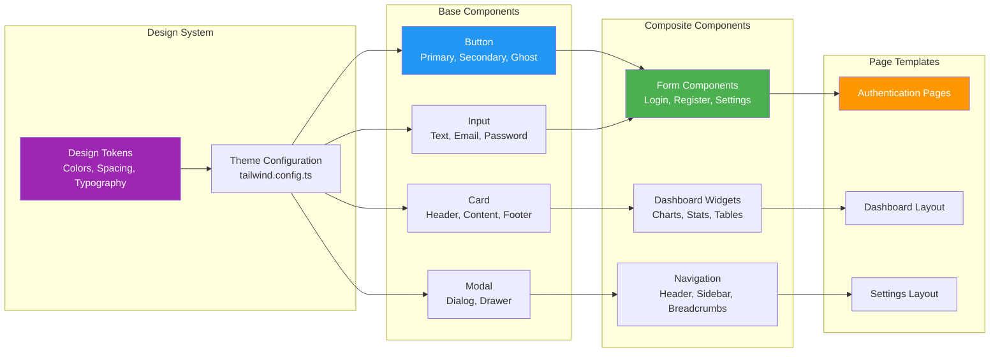
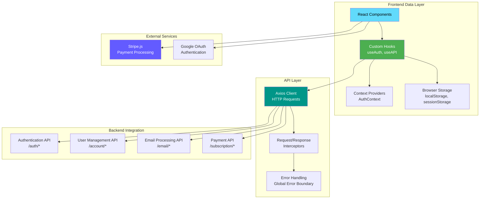
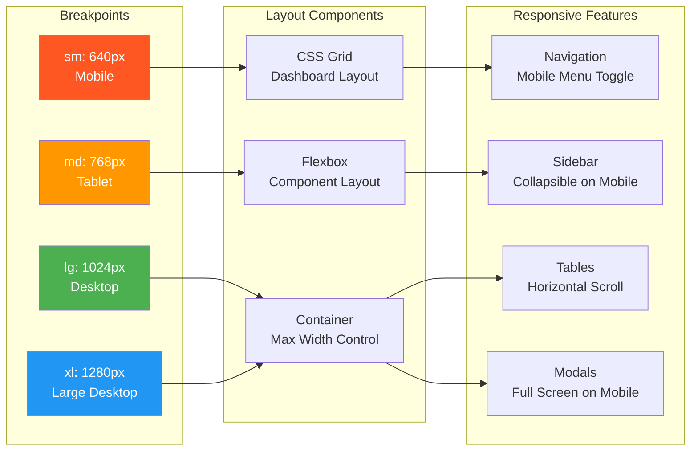

# Notaic Frontend

[](https://nextjs.org/)
[](https://reactjs.org/)
[](https://www.typescriptlang.org/)
[](https://tailwindcss.com/)

Modern, responsive frontend for Notaic - an email automation and management platform. Built with Next.js, React, TypeScript, and TailwindCSS.

## ✨ Features

- **Modern Tech Stack**
  - Next.js 14 with App Router
  - React 18 with Hooks
  - TypeScript for type safety
  - TailwindCSS for styling

- **UI Components**
  - Radix UI primitives
  - Custom components
  - Responsive design
  - Dark/Light mode support

- **Data Visualization**
  - Chart.js integration
  - Tremor components
  - Interactive dashboards

- **Authentication**
  - Secure user authentication
  - Protected routes
  - OAuth integration

- **Payment Integration**
  - Stripe payment processing
  - Subscription management
  - Secure checkout flow

## Frontend Architecture

### Application Architecture



### Component Hierarchy



### State Management Flow



### UI Component System



### Data Flow & API Integration



### Responsive Design System



## 🚀 Getting Started

### Prerequisites

- Node.js 18.x or higher
- npm or yarn
- Git

### Installation

1. Clone the repository:
   ```bash
   git clone https://github.com/yourusername/NotaicFrontend.git
   cd frontend
   ```

2. Install dependencies:
   ```bash
   npm install
   # or
   yarn install
   ```

3. Set up environment variables:
   Create a `.env.local` file in the root directory:
   ```env
   NEXT_PUBLIC_API_URL=http://localhost:8000
   NEXT_PUBLIC_STRIPE_PUBLISHABLE_KEY=your_stripe_key
   # Add other required environment variables
   ```

### Development

Run the development server:
```bash
npm run dev
# or
yarn dev
```

Open [http://localhost:3000](http://localhost:3000) in your browser.

### Building for Production

```bash
npm run build
# or
yarn build
```

### Running Production Build

```bash
npm run start
# or
yarn start
```

## 📁 Project Structure

```
frontend/
├── app/                 # Next.js app directory
│   ├── layout.tsx      # Root layout
│   ├── page.tsx        # Home page
│   └── [...routes]/    # Application routes
├── components/         # React components
│   ├── ui/            # UI components
│   └── shared/        # Shared components
├── lib/               # Utility functions
├── public/            # Static assets
├── styles/           # Global styles
├── types/            # TypeScript types
└── config/           # Configuration files
```

## 🎨 Styling

- TailwindCSS for utility-first styling
- Custom theme configuration
- Dark mode support
- Responsive design system

## 🔧 Configuration Files

- `next.config.mjs` - Next.js configuration
- `tailwind.config.ts` - TailwindCSS configuration
- `tsconfig.json` - TypeScript configuration
- `postcss.config.mjs` - PostCSS configuration

## 🐳 Docker Support

Build the Docker image:
```bash
docker build -t notaic-frontend .
```

Run the container:
```bash
docker run -p 3000:3000 notaic-frontend
```

## 🧪 Testing

```bash
# Run ESLint
npm run lint

# Run type checking
npm run type-check
```

## 📝 Development Guidelines

1. **Code Style**
   - Follow TypeScript best practices
   - Use functional components and hooks
   - Implement proper error handling
   - Write meaningful comments

2. **Component Structure**
   - Keep components small and focused
   - Use proper file naming conventions
   - Implement proper prop typing
   - Follow atomic design principles

3. **State Management**
   - Use React hooks effectively
   - Implement proper data fetching
   - Handle loading and error states

## 🔒 Security Best Practices

- Environment variables for sensitive data
- Input validation and sanitization
- Secure API communication
- Protected routes implementation
- XSS prevention

## 🤝 Contributing

1. Fork the repository
2. Create your feature branch (`git checkout -b feature/AmazingFeature`)
3. Commit your changes (`git commit -m 'Add some AmazingFeature'`)
4. Push to the branch (`git push origin feature/AmazingFeature`)
5. Open a Pull Request

## 📄 License

This project is licensed under the MIT License - see the [LICENSE](LICENSE) file for details.

## 📧 Support

For support, please open an issue in the GitHub repository or contact the development team.

---
Built with ❤️ using Next.js and React
